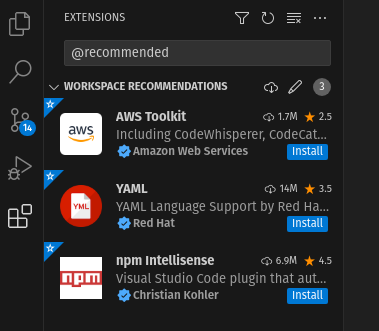
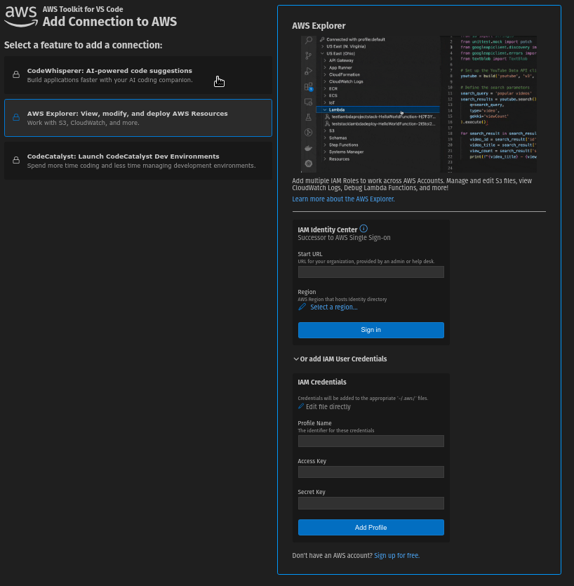
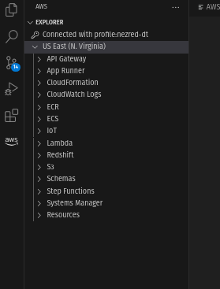

# Setup instructions

## Previous installation

* [aws cli](https://docs.aws.amazon.com/cli/latest/userguide/getting-started-install.html)
* [aws-sam-cli](https://docs.aws.amazon.com/serverless-application-model/latest/developerguide/install-sam-cli.html)
* [VSCode](https://code.visualstudio.com/)
* [git](https://git-scm.com/downloads)
* [npm](https://docs.npmjs.com/downloading-and-installing-node-js-and-npm)
* nodejs
* typescript
* docker (needed in order to run the backend locally, for development)

## VSCode setup

1. Clone the repo. You need to sign in with github in order to avoid
   authentication issues.

2. Install the recommended extensions (workspace recommendations)
   
   
3. When you do this the screen for the AWS extension will open. To sign
   in with the provided credentials, we will go to AWS Explorer, then open
   "Or add IAM User Credentials" and enter you username in the profile
   name, and the 2 credentials provided for login.

   

4. You will probably have this on your aws tab. We will be using
   `eu-north-1` as the region. In order to change it, just right click the
   region 'US East', and on 'Show or Hide regions'. Then deselect the one
   you have, and search for `eu-north-1` 'Europe (Stockholm)'.

   

5. with that you should be able to see the endpoints in API Gateway, and if you right click on them and use 'Invoke on AWS', you will be able to send custom calls on them for testing. You can also run locally the backend with `sam local invoke`, or start a local api with `sam local start-api` (i usually use the second one).